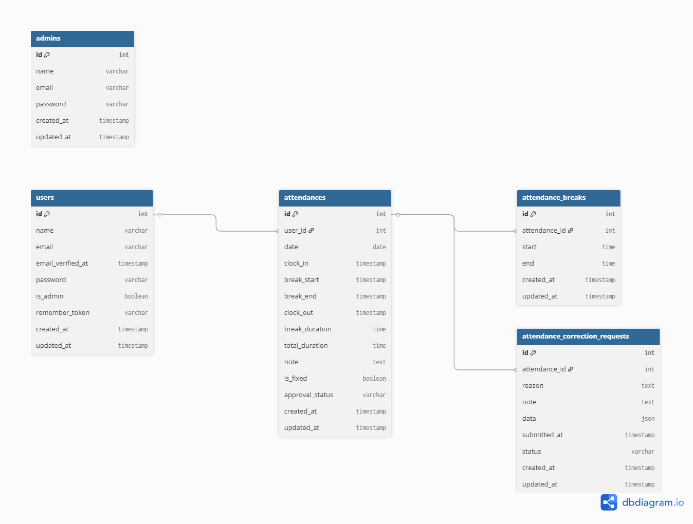

# 勤怠管理アプリ「kintaikanri」

Laravel + Fortify を用いて構築した PC 専用の勤怠管理システムです。
一般ユーザーと管理者のログイン認証を完全に分離し、勤怠打刻・修正申請・承認処理まで一元管理できます。

---

## 環境構築

### Docker ビルド

1. git clone https://github.com/kie-okamoto/kintaikanri.git
2. Docker Desktop アプリを立ち上げる
3. `docker compose up -d --build`

### Laravel 環境構築

1. `docker compose exec app bash`
2. `composer install`
3. `.env.example` を `.env` にコピーまたは新規作成
4. `.env` に以下を追加（DB・メール設定）

```env
DB_CONNECTION=mysql
DB_HOST=mysql
DB_PORT=3306
DB_DATABASE=laravel_db
DB_USERNAME=laravel_user
DB_PASSWORD=laravel_pass
MAIL_MAILER=smtp
MAIL_HOST=mailhog
MAIL_PORT=1025
MAIL_FROM_ADDRESS=example@example.com
MAIL_FROM_NAME="KintaiApp"
```

5. アプリケーションキーの作成 `php artisan key:generate`
6. マイグレーションの実行 `php artisan migrate`
7. シーディングの実行 `php artisan db:seed`

### テストの実行方法

1. .env をコピーして .env.testing を作成 `cp .env .env.testing`

```env
APP_NAME=Laravel
APP_ENV=testing
APP_KEY=base64:xxxxxxxxxxxxxxxxxxxxxxxxxxxxxxxxxxxxxxxxxxx=
APP_DEBUG=true
APP_URL=http://localhost

LOG_CHANNEL=stack
LOG_LEVEL=debug

DB_CONNECTION=sqlite
DB_DATABASE=:memory:

CACHE_DRIVER=array
SESSION_DRIVER=array
QUEUE_CONNECTION=sync

MAIL_MAILER=smtp
MAIL_HOST=mailhog
MAIL_PORT=1025
MAIL_USERNAME=null
MAIL_PASSWORD=null
MAIL_ENCRYPTION=null
MAIL_FROM_ADDRESS=null
MAIL_FROM_NAME="${APP_NAME}"

FILESYSTEM_DRIVER=local
BROADCAST_DRIVER=log

REDIS_HOST=127.0.0.1
REDIS_PASSWORD=null
REDIS_PORT=6379

MOCK_STRIPE=true
```

2. テスト実行 `php artisan test`

## 使用技術

- Laravel 8.83.8
- PHP 8.1
- MySQL 8.0.26
- Docker / Docker Compose
- Mailhog（開発用メール送信確認）

## 初期ログイン情報（ダミーデータ）

Seeder により以下のユーザー情報が初期登録されます。

### 一般ユーザー（メール認証済）

| 氏名           | メールアドレス    | パスワード |
| -------------- | ----------------- | ---------- |
| 一般ユーザー 1 | user1@example.com | test123    |
| 一般ユーザー 2 | user2@example.com | test123    |
| 一般ユーザー 3 | user3@example.com | test123    |
| 一般ユーザー 4 | user4@example.com | test123    |
| 一般ユーザー 5 | user5@example.com | test123    |

### 管理者ユーザー（メール認証不要）

| 氏名           | メールアドレス    | パスワード |
| -------------- | ----------------- | ---------- |
| 管理者ユーザー | admin@example.com | admin123   |

## ER 図



## URL

- 開発環境: http://localhost/
- 一般ユーザーログイン画面: http://localhost/login
- 管理者ログイン画面: http://localhost/admin/login
- phpMyAdmin: http://localhost:8080/
- Mailhog（メール確認）: http://localhost:8025/
